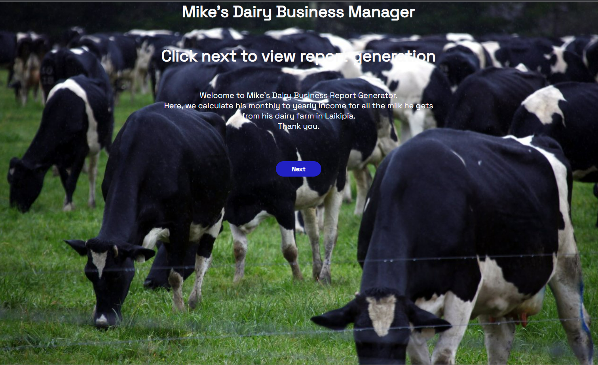

<<<<<<< HEAD
## About The Project

# Project Name

    Dairy Business

## Authors Name

    Denis Ouma Otieno

## Table of contents

- [General info](#general-info)
- [Technologies](#technologies)
- [Setup](#setup)
- [contac](#contact)

## General info

This project is an online store for the AgriPlus agricultural cooperative, which gives farmers a platform to connect with consumers across the nation and sell or buy their produce while interacting with them to produce high-quality produce. Users can register and create an account, from which they can buy and order agricultural products from the growers. The page also has a description of some of their services, a contact form, and an additional form that allows users to sign up for Agriplus's newsletter to receive notifications of any interesting farming bargains or offers. This facilitates communication with both customers and farmers.

## Technologies

    Project is created with:

        - HTML - Is used to build the structure of the pages.
        - CSS - Is used to style the pages
        - JavaScript - Is used to impliment the website functionality.
        - Google Fonts and Icons - Is used to impliment the icons and the fonts on the page

## Requirements

-Either a computer, Ipad, tablet or phone -An access to internet connection

## Program Setup

To run this project, clone or download it from git hub. Using Live server or your developers environment(Text Editor), start the server using Live server extention

## Contact

    emain: dennisouma38@gmail.com

linkedin:
https://www.linkedin.com/in/denisouma/

## Live GitHub Pages Link

The webpage address:

https://denisouma.github.io/agri-plus/

## License information

[MIT](LICENCE)

Copyright (c) 2022 Denis Ouma Otieno
=======
# About The Project:

            Week III  Assignment

## Project Name

            Mike's Dairy Business  

## Author Details:

#### Name:
    Ian Mike Kaibi
#### Email: 
    ian.kaibi@student.moringaschool.com

Reach out on Twitter:

[Code Sketcher](https://twitter.com/Bit_Bytes_Bits)

## Table of Contents

- [Description](#description)
- [Project Build Up](#project-build-up)
- [Requirements](#requirements)
- [Program Setup](#program-setup)
- [Live Link](#live-link-to-project)
- [Project Images](#project-images)
- [License](#license-information)

## Description
This project is a demonstration of the concepts learnt from week 1 to week 3. Its aim is to create a production monitoring system for dairy cows that should take input in form of liters and price in Kenyan Shillings and produces the desired output.  
          
It is also capable of comparing price change when the buying price is adjusted accordingly. 

## Project Build Up

             Project is created in:

- `HTML` - Used to build the structure of the webpage.
- `CSS` - Used to apply style to the site.
- `JavaScript` - To add logic to the webpage.

## Requirements
- A computer.  
* Visual studio code with the following extensions and library:  

          * Code Runner.
          * Live Server.
          * Prettier formater.
          * Node JS should be installed prior to executing the codes on your computer.

* A working internet connection.

## Program Setup
1. Clone the repository to your computer using:

        git clone (link to repository)

2. Open the root of the folder on your visual studio code.

3. Run Live share and view the rendered page on your browser. 

## Live Link To Project:  

[Click here](https://bit-bytes-bits.github.io/Moringa_Week_III_IP/)

## Project Images
Image 1
  

Image 2
  

Image 3

## License Information

The MIT License (MIT)
Copyright © 2022 [Ian Mike Kaibi](https://github.com/Bit-Bytes-Bits)  
>>>>>>> dcdea44e4f771811300306c0cc57c8ca349fd853

Permission is hereby granted, free of charge, to any person obtaining a copy
of this software and associated documentation files (the "Software"), to deal
in the Software without restriction, including without limitation the rights
to use, copy, modify, merge, publish, distribute, sublicense, and/or sell
copies of the Software, and to permit persons to whom the Software is
furnished to do so, subject to the following conditions:

The above copyright notice and this permission notice shall be included in all
copies or substantial portions of the Software.

THE SOFTWARE IS PROVIDED "AS IS", WITHOUT WARRANTY OF ANY KIND, EXPRESS OR
IMPLIED, INCLUDING BUT NOT LIMITED TO THE WARRANTIES OF MERCHANTABILITY,
FITNESS FOR A PARTICULAR PURPOSE AND NONINFRINGEMENT. IN NO EVENT SHALL THE
AUTHORS OR COPYRIGHT HOLDERS BE LIABLE FOR ANY CLAIM, DAMAGES OR OTHER
LIABILITY, WHETHER IN AN ACTION OF CONTRACT, TORT OR OTHERWISE, ARISING FROM,
OUT OF OR IN CONNECTION WITH THE SOFTWARE OR THE USE OR OTHER DEALINGS IN THE
<<<<<<< HEAD
SOFTWARE.
=======
SOFTWARE.

Thank you.
>>>>>>> dcdea44e4f771811300306c0cc57c8ca349fd853
